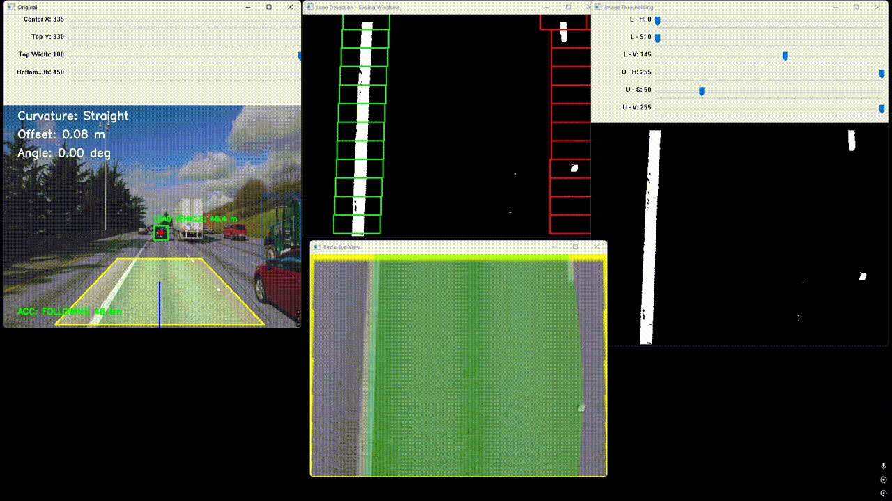
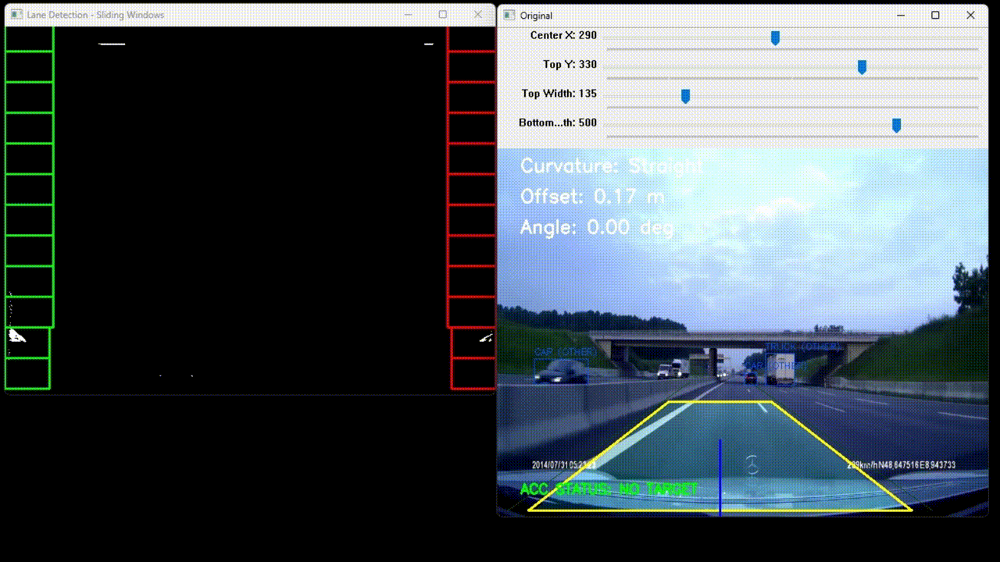

# Lane Keeping & Vehicle Tracking with AEB

## Key Features 

* **Lane Detection:** Computer vision pipeline featuring Image Resizing, Region of Interest (ROI) selection, Bird's Eye View perspective warp, HSV color thresholding, and pixel-density Histograms.
* **Curve Tracking:** Fits 2nd-degree mathematical polynomials over a customized Sliding Window search algorithm.
* **Validation Filtering:** A noise-reduction algorithm that rejects high-frequency spatial jitter (caused by road shadows or missing dashed markers) by holding lane parameters stable unless a drift persists.
* **Vehicle Detection:** Integrates a lightweight YOLOv8 nano model.
* **ACC Target Acquisition:** Selects primary lead vehicle inside the lane while ignoring adjacent traffic.
* **Telemetry & AEB Simulation:** Real-time distance mapping based on bounding box focal scaling proxies, calculating road curvature radius, lateral lane offset, steering angle, and **Autonomous Emergency Braking**.

# Demos
### 1. Adaptive Lane Keeping & Active Cruise Control Tracking


### 2. Forward Collision Warning & Autonomous Emergency Braking


## Technical Limitations

As this prototype relies heavily on Computer Vision rather than Deep Learning for spatial navigation, it has its limitations:
* **Camera Geometry Dependency:** The Bird's Eye View transformation matrix uses fixed perspective coordinates. Changes in camera mounting angles, height, or vehicle pitch require manual recalibration via the geometry trackbars to prevent lane projection warping.
* **Environmental & Lighting Sensitivity:** The lane segmentation relies on HSV color thresholding. Drastic changes in ambient lighting (e.g. sudden tunnels, heavy rain, or wet asphalt glare) can degrade pixel density tracking performance.
* **Vehicle Scale Distances:** Distance estimation uses a 2D bounding box width proxy. If a vehicle is partially occluded, cuts into the lane abruptly, or drifts significantly from a standard horizontal profile, the raw distance metrics can experience brief calculation spikes before smoothing takes effect.

## Installation & Setup

1. Clone or download this repository.
2. Download the required sample video assets and place them directly into the root directory:
   * [Normal driving video](https://drive.google.com/file/d/1fOnrfL5mu-CmKT3tunNLxE9kLy5hxRNe/view?usp=sharing)
   * [Emergency breaking video](https://drive.google.com/file/d/1GzIvWXMxN9ISARBX5PuI-zf4NHpMBBVV/view?usp=sharing)
3. Install Required libraries: OpenCV, NumPy, Ultralytics (YOLOv8)
```bash
pip install opencv-python numpy ultralytics

